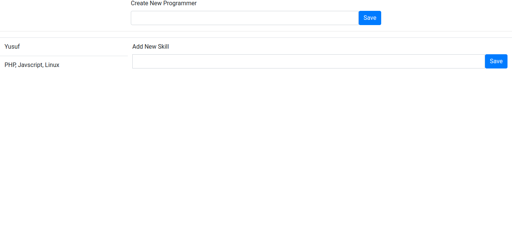

# Arkademy-Test
My answers for Bootcamp 10 Arkademy - Online Test.

## Tech Stack
- Programming Language: PHP
- Online Compiler: http://www.writephponline.com/

## What is REST API?
- REST API defines a set of functions which developers can perform requests and receive responses via HTTP protocol such as GET, POST, PUT, and DELETE. (Source: https://www.sitepoint.com/developers-rest-api)
- JSON is one of file format transfers used in REST, besides XML.

## Soal 6: Before

## Soal 6: Process

## Soal 6: After
